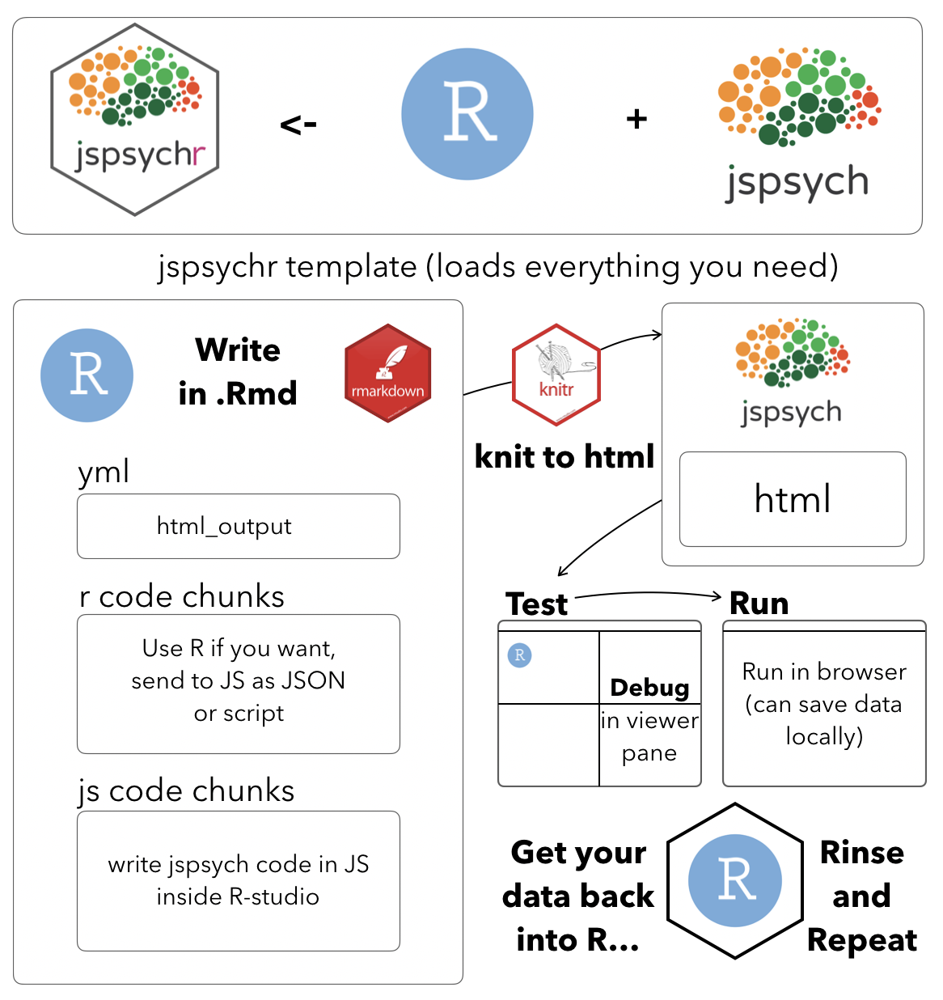

# jspsychr 

[](https://www.tidyverse.org/lifecycle/#experimental)

This is an R markdown template and functions for writing and running jspsych experiments using R studio.

- [jspsych](https://www.jspsych.org) is javascript library for web-based behavioral experiments written by Josh De Leeuw.

- If you are interested in other approaches to build jspsych experiments, also check out Danielle Navarro's [xprmntr](https://github.com/djnavarro/xprmntr), and [jaysire](https://github.com/djnavarro/jaysire)

- jspsychr developed as a forked offshoot of the original xprmntr package

## Install

```
# install.packages("devtools")
devtools::install_github("CrumpLab/jspsychr")
```

<div class="row">
<div class="col-sm-6">

<h2>Overview</h2>



</div>
<div class="col-sm-6">

<h2>Examples</h2>

Read the getting started article (above) for an overview of how `jspsychr` works, and/or head over to the examples repo to see some examples, <a href="https://github.com/CrumpLab/jspsychrexamples">https://github.com/CrumpLab/jspsychrexamples</a>

<h2>Contributors</h2>

Matt Crump {jspsychr}, Danielle Navarro {code to run experiments locally with plumber, and to save data from a local session}; Josh De Leeuw {the jspsych javascript library}

</div>
</div>


